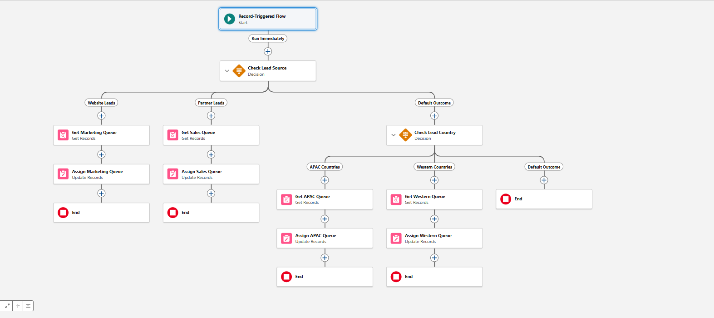

# Salesforce Lead Routing Automation

A declarative Salesforce automation that routes new Leads to the correct queue
the moment they are created — no Apex, no code.

---

## How It Works

When a Lead record is created in Salesforce, a **Record-Triggered Flow** fires
immediately and assigns the Lead to a queue based on two criteria:

### 1. Lead Source Routing (checked first)

| Lead Source      | Assigned Queue   |
|------------------|------------------|
| Web              | Marketing Leads  |
| Partner Referral | Sales Leads      |

### 2. Country Fallback Routing (when Lead Source does not match)

| Country                       | Assigned Queue |
|-------------------------------|----------------|
| Bangladesh, India, Singapore  | APAC Leads     |
| United States, United Kingdom | Western Leads  |

If neither condition matches, the Lead retains its default owner.

---

## Flow Diagram



The Flow starts on Lead creation and runs two Decision elements:

1. **Check Lead Source** — branches into Website Leads, Partner Leads, or Default Outcome
2. **Check Lead Country** (Default Outcome path) — branches into APAC Countries, Western Countries, or ends with no change

Each branch uses **Get Records** to fetch the queue's Group ID, then **Update Records** to set the Lead's `OwnerId`.

---

## Salesforce Concepts Used

| Concept                   | Purpose in This Project                                              |
|---------------------------|----------------------------------------------------------------------|
| **Record-Triggered Flow** | Fires on Lead creation without any code                              |
| **Decision**              | Branches routing logic by Lead Source and Country                    |
| **Get Records**           | Fetches the Group (Queue) record to retrieve its ID                  |
| **Update Records**        | Sets `OwnerId` on the Lead to the Queue's Group ID                   |
| **Queues**                | Four queues: Marketing Leads, Sales Leads, APAC Leads, Western Leads |
| **Lead Owner Assignment** | Uses the Queue Group ID as the Lead's owner                          |
| **Data Import Wizard**    | Used to import sample Lead records for testing                       |

---

## Project Structure

```
salesforce-lead-routing/
├── force-app/
│   └── main/
│       └── default/
│           └── flows/          ← Retrieved Flow metadata (XML)
├── sample-data/                ← Sample CSV files used for testing
├── screenshots/                ← Flow screenshots from Setup
└── README.md
```

---

## Testing

Testing was performed directly in the Salesforce Developer Edition org:

1. **Data Import Wizard** was used to import sample Lead records with varying
   Lead Source values (`Web`, `Partner Referral`) and Country values
   (`Bangladesh`, `India`, `Singapore`, `United States`, `United Kingdom`).
2. After import, each Lead's **Owner** field was verified to confirm it matched
   the expected queue.
3. The Flow was validated by inspecting the Flow's **Run History** in Setup.

---

## Setup & Retrieval

This project was built declaratively inside a Salesforce Developer Edition org
and retrieved using the Salesforce CLI:

```bash
# Authorize org
sf org login web --alias lead-routing-dev

# List available Flows (to confirm API name)
sf org list metadata --metadata-type Flow --target-org lead-routing-dev

# Retrieve Flow metadata
sf project retrieve start --metadata "Flow:<FlowApiName>" --target-org lead-routing-dev
```

---

## Notes

- Built entirely with point-and-click tools (Flow Builder, Queues setup).
- No Apex code, no custom objects, no third-party integrations.
- Flow is active in the Developer Edition org.
